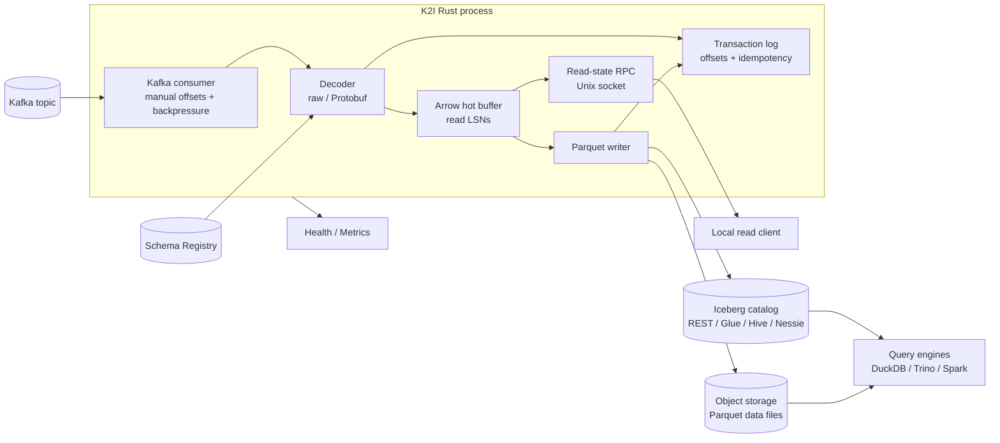
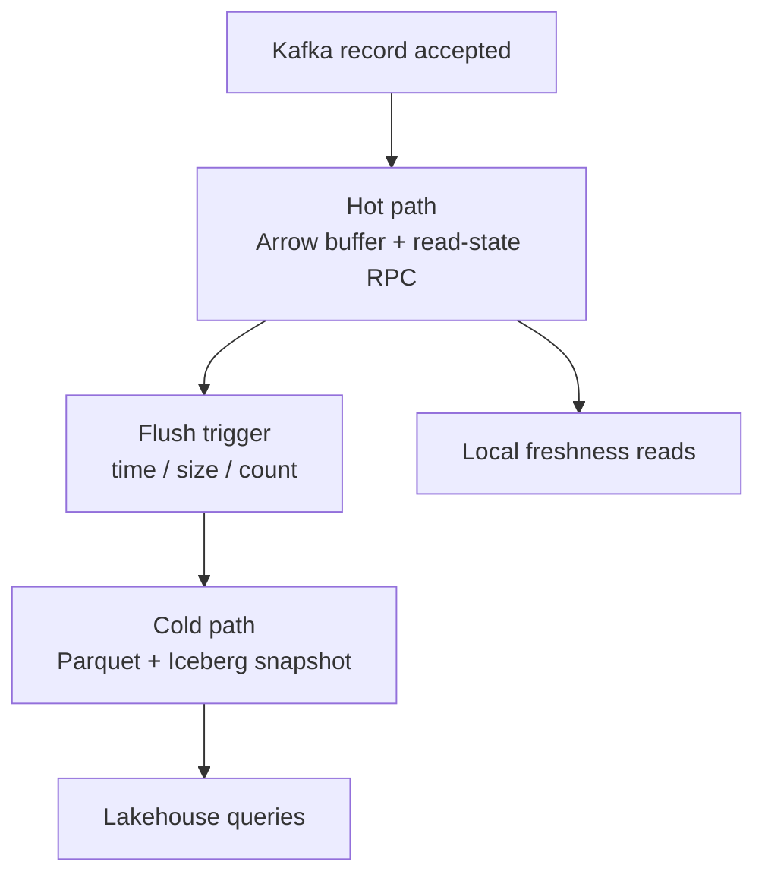

<p align="center">
  <h1 align="center">K2I: Kafka to Apache Iceberg in One Rust Binary</h1>
  <p align="center">
    Stream final-form Kafka events into Apache Iceberg tables with Protobuf Schema Registry decoding, Arrow hot reads, Parquet writes, and Docker-verified DuckDB/Iceberg validation.
  </p>
</p>

<p align="center">
  <a href="https://github.com/osodevops/k2i/actions/workflows/test.yml">
    
  </a>
  <a href="https://github.com/osodevops/k2i/blob/main/LICENSE">
    
  </a>
  <a href="https://github.com/osodevops/k2i/releases">
    
  </a>
</p>

---

**K2I** is an open-source, standalone Kafka-to-Iceberg ingestion engine written in Rust. It consumes a Kafka topic, decodes raw or Confluent-framed Protobuf messages, keeps recent rows visible through an Arrow-backed local read path, and flushes Parquet data files through Iceberg catalog commits.

K2I is built for teams that want fresh lakehouse tables without operating a Flink job, Spark micro-batch pipeline, or Kafka Connect cluster for a simple final-form event stream. One process owns one configured Kafka topic and one configured Iceberg table today.

## Use K2I When

- You have final-form Kafka events that should become analytics rows in Apache Iceberg.
- You want a single Rust service/container instead of a stream-processing cluster for this ingestion job.
- You need local fresh-read visibility before the next Iceberg snapshot is committed.
- You use Confluent Schema Registry Protobuf and want additive schema evolution guarded by readiness checks.
- You want local Docker E2E validation that proves the written Iceberg table is readable by DuckDB.

K2I is not a general stream processing framework. Use Flink or another stream processor for joins, windows, stateful transformations, multi-source ETL, or complex CDC delete/update semantics.

## Quick Local Proof

Run the real Iceberg/DuckDB flow locally:

```bash
scripts/e2e-docker-iceberg.sh
```

The script starts Kafka, Schema Registry, K2I, an Iceberg REST fixture, and the E2E runner. A passing run ends with:

```text
ok: DuckDB iceberg_scan validated real Iceberg metadata
```

Run the local Iceberg load profile with 100,000 rows:

```bash
K2I_E2E_LOAD_MESSAGES=100000 scripts/e2e-docker-iceberg-load.sh
```

## What K2I Does

| Capability | Current behavior |
|---|---|
| Kafka ingest | Uses `rdkafka`, manual offset management, batching, retry, and backpressure |
| Payload decoding | Raw bytes, JSON-compatible raw payloads, and Confluent-framed Protobuf |
| Schema Registry | Resolves Protobuf descriptors, caches schemas in memory and on disk, supports subject strategies |
| Schema evolution | Adds compatible nullable Protobuf fields and pauses readiness on breaking changes |
| Hot reads | Exposes local read-state RPC over a Unix socket with Arrow IPC rows and committed file references |
| Iceberg writes | Writes Parquet files and commits real Iceberg REST metadata through `iceberg-rust` |
| Durability design | Records offsets, flushes, files, schema events, and idempotency data in an append-only transaction log |
| Operations | HTTP health/readiness, Prometheus metrics, CLI commands, generated man pages, and Docker E2E scripts |

## Architecture



K2I separates hot and cold visibility:



Hot-path visibility is local and intended for co-located readers or sidecars. Cold-path visibility depends on flush thresholds, object-store writes, and Iceberg catalog commit timing.

## K2I vs Alternatives

| Dimension | K2I | Kafka Connect Iceberg Sink | Flink Iceberg Sink | Spark Micro-Batch | Confluent TableFlow | Moonlink |
|---|---|---|---|---|---|---|
| Primary fit | Final-form Kafka events to Iceberg | Connector-based ingestion | Stream processing and transforms | Batch/micro-batch ETL | Managed Confluent pipeline | Postgres CDC to Iceberg |
| Deployment | Single Rust binary/container | Kafka Connect cluster | Flink cluster | Spark runtime | Managed service | Service/extension stack |
| Transformations | Intentionally minimal | SMT/basic connector config | Strong | Strong | Limited/managed | CDC-focused |
| Hot reads | Local Arrow read-state RPC | No | No native local hot path | No | No local hot path | CDC-oriented |
| Schema path | Confluent Protobuf additive evolution | Connector/schema dependent | Engine dependent | Job dependent | Managed | CDC/schema dependent |
| Choose when | Events are already analytics-shaped | You already run Connect | You need joins/windows/state | Batch jobs are acceptable | You use Confluent Cloud | Source is Postgres |

See [comparisons](docs/comparisons.md) for the longer decision guide.

## Installation

Download the latest binary from the [GitHub Releases](https://github.com/osodevops/k2i/releases) page.

### macOS

```bash
brew install osodevops/tap/k2i
```

### Linux / macOS Shell Installer

```bash
curl --proto '=https' --tlsv1.2 -LsSf https://github.com/osodevops/k2i/releases/latest/download/k2i-cli-installer.sh | sh
```

### Docker

```bash
docker pull ghcr.io/osodevops/k2i:latest
docker run --rm -v /path/to/config:/etc/k2i ghcr.io/osodevops/k2i:latest ingest --config /etc/k2i/config.toml
```

The image is published for `linux/amd64` and `linux/arm64`; Docker pulls the
matching architecture automatically.

The GHCR package must be set to public separately from the GitHub repository
visibility. Release CI verifies anonymous manifest access for the published tag
and `latest`, and confirms both platforms are present.

### From Source

```bash
git clone https://github.com/osodevops/k2i.git
cd k2i
cargo build --release
```

Binary location: `target/release/k2i`

Source builds require Rust 1.75+, CMake, and OpenSSL development libraries. Kerberos/GSSAPI support is not enabled by default; if you need it, add the `gssapi` feature to `rdkafka` and install the matching SASL development libraries for your platform.

## Quick Start

Create a minimal configuration:

```toml
[kafka]
bootstrap_servers = ["localhost:9092"]
topic = "events"
consumer_group = "k2i-ingestion"

[kafka.format]
type = "raw"

[schema_evolution]
mode = "auto-additive"
on_breaking_change = "pause"
schema_update_min_interval_seconds = 60

[buffer]
max_size_mb = 500
flush_interval_seconds = 30
flush_batch_size = 10000

[iceberg]
catalog_type = "rest"
warehouse_path = "s3://my-bucket/warehouse"
database_name = "analytics"
table_name = "events"
rest_uri = "http://localhost:8181"

[transaction_log]
log_dir = "./transaction_logs"

[monitoring]
metrics_port = 9090
health_port = 8080

[rpc]
enabled = false
```

Validate and run:

```bash
k2i validate --config config.toml
k2i ingest --config config.toml
```

Monitor:

```bash
k2i status --url http://localhost:8080
curl http://localhost:8080/health
curl http://localhost:9090/metrics
```

Use [config/example.toml](config/example.toml) and the [configuration reference](docs/configuration.md) for the complete set of options.

## What Is Validated

The current implementation has been verified locally with:

```bash
cargo fmt --all --check
git diff --check
cargo check --workspace --all-targets
cargo clippy --workspace --all-targets -- -D warnings
cargo test --workspace --no-fail-fast
cargo run -p k2i-cli -- completions man --output-dir docs/man/man1
cargo test -p k2i-cli --test man_pages --no-fail-fast
scripts/e2e-docker.sh
K2I_E2E_LOAD_MESSAGES=100000 scripts/e2e-docker-load.sh
scripts/e2e-docker-iceberg.sh
K2I_E2E_LOAD_MESSAGES=100000 scripts/e2e-docker-iceberg-load.sh
```

The Docker flows cover Protobuf schema evolution, schema-pause readiness behavior, read-state RPC, direct Parquet validation with DuckDB, real Iceberg REST metadata commits, snapshot growth, and DuckDB `iceberg_scan`.

## Current Release Caveats

K2I is ready for a first public release as a production-oriented Kafka-to-Iceberg ingestion engine, but these areas should remain explicit follow-up items before broad production rollout:

- Multi-partition flush and offset commit behavior needs continued hardening.
- Startup recovery computes state, but Kafka seeking/deduplication and startup orphan cleanup need further wiring.
- Kafka offset commits are async; broker durability acknowledgement is not confirmed by the current helper.
- Transaction-log entries are flushed, but not every entry is fsynced individually.
- GCS and Azure object-store configuration is declared, but writer creation is not complete for those backends.
- Maintenance commands and task implementations exist; scheduler wiring should be reviewed for each deployment.

See [Production Readiness](docs/production-readiness.md) for the detailed review checklist.

## Documentation

| Guide | Description |
|---|---|
| [Kafka to Iceberg](docs/kafka-to-iceberg.md) | Main explanation of the K2I data path |
| [Quickstart](docs/quickstart.md) | Local proof and first manual run |
| [Configuration](docs/configuration.md) | Complete TOML reference |
| [Architecture](docs/architecture.md) | System design, ordering, and hot/cold reads |
| [Comparisons](docs/comparisons.md) | K2I vs Kafka Connect, Flink, Spark, TableFlow, and Moonlink |
| [DuckDB Iceberg Validation](docs/duckdb-iceberg-validation.md) | How local Docker E2E proves real Iceberg metadata |
| [Schema Registry Protobuf](docs/schema-registry-protobuf.md) | Protobuf decoding and schema evolution |
| [Iceberg REST Catalog](docs/iceberg-rest-catalog.md) | REST catalog commit path and backend caveats |
| [Commands](docs/commands.md) | CLI command reference |
| [Man Pages](docs/man/man1/k2i.1) | Generated man pages for every CLI command and subcommand |
| [Deployment](docs/deployment.md) | Deployment patterns and operational notes |
| [Troubleshooting](docs/troubleshooting.md) | Common issues and recovery guidance |
| [FAQ](docs/faq.md) | Short answers for common user questions |
| [Production Readiness](docs/production-readiness.md) | Verification status, caveats, and follow-up issues |

## Project Structure

```text
k2i/
|-- crates/
|   |-- k2i-core/         # Core ingestion library
|   |-- k2i-cli/          # CLI binary and HTTP server
|   |-- k2i-rpc/          # Read-state protocol types and framing
|   |-- k2i-rpc-server/   # Unix socket RPC server
|   `-- k2i-e2e-runner/   # Docker E2E producer/verifier
|-- config/               # Example configuration
|-- docker/e2e/           # Local E2E compose stacks
|-- docs/                 # Current release docs plus historical archive
`-- scripts/              # E2E wrapper scripts
```

## FAQ

**Is K2I a Kafka Connect plugin?**

No. K2I is a standalone Rust service with its own Kafka consumer, transaction log, writer, CLI, health server, and metrics server.

**Does K2I provide exactly-once delivery?**

K2I is designed for exactly-once-style durability by combining manual Kafka offset management, transaction-log recovery records, idempotency records, immutable Parquet writes, and atomic Iceberg commits. See the production-readiness caveats for the remaining hardening work.

**How fresh is data in K2I?**

Recent rows can be visible through the local read-state RPC before the next cold commit. Iceberg query engines see data after a flush writes Parquet and commits an Iceberg snapshot.

**Can DuckDB read tables written by K2I?**

Yes. The Docker Iceberg E2E validates K2I output with DuckDB direct Parquet reads and DuckDB `iceberg_scan` against real Iceberg REST metadata.

**Is K2I a CDC tool?**

No. K2I is Kafka-native and optimized for append-oriented event streams. CDC updates/deletes and deletion vectors are outside the current scope.

See the full [FAQ](docs/faq.md).

## Looking for Enterprise Apache Kafka Support?

[OSO](https://oso.sh) engineers are focused on deploying, operating, and maintaining Apache Kafka platforms. If you need SLA-backed support, security review, deployment help, or a broader data lakehouse strategy, contact **enquiries@oso.sh** or visit [oso.sh/contact](https://oso.sh/contact/).

## Contributing

- Report bugs with a minimal reproduction and relevant config.
- Suggest features with the target workflow and failure mode.
- Run the verification commands above before opening a PR that changes ingestion, schema, catalog, or CLI behavior.
- Regenerate man pages after changing CLI help text, flags, or subcommands:

```bash
cargo run -p k2i-cli -- completions man --output-dir docs/man/man1
```

## License

K2I is licensed under the [Apache License 2.0](LICENSE).

## Acknowledgments

K2I draws architectural inspiration from Moonlink by Mooncake Labs, adapted for Kafka-native final-form event streams rather than Postgres CDC.

Built with:

- [rdkafka](https://crates.io/crates/rdkafka)
- [arrow](https://crates.io/crates/arrow)
- [parquet](https://crates.io/crates/parquet)
- [iceberg](https://crates.io/crates/iceberg)
- [tokio](https://tokio.rs)
- [axum](https://crates.io/crates/axum)
