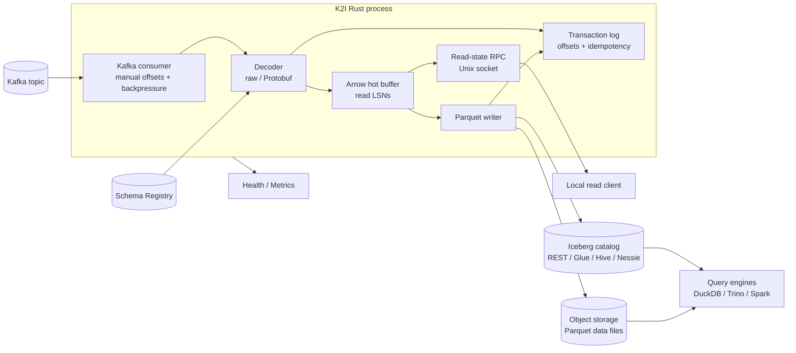
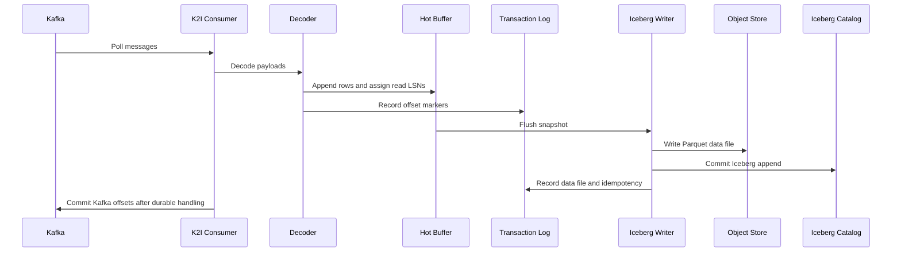
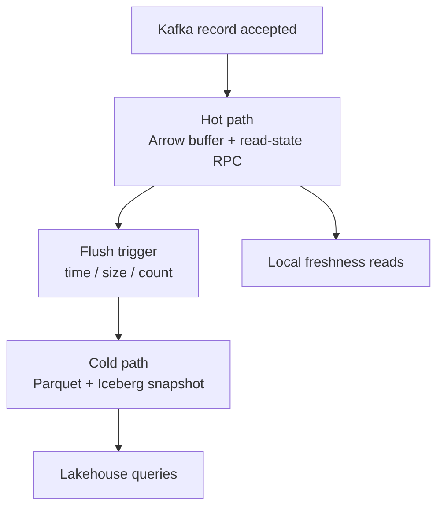
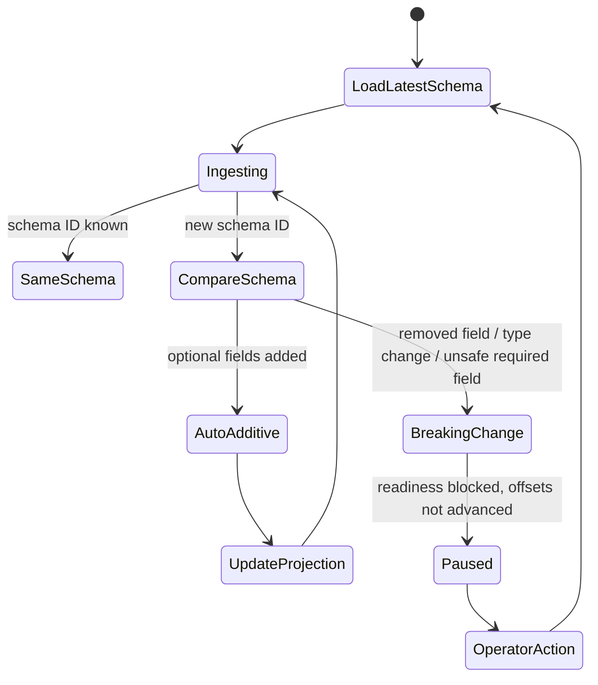
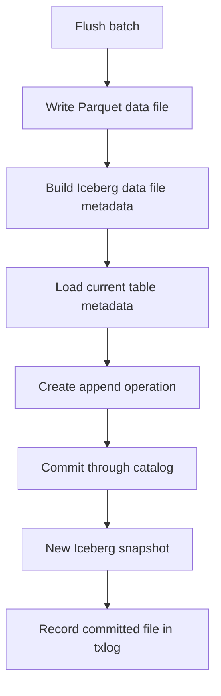

# K2I Architecture

K2I is a single-process Kafka-to-Iceberg ingestion engine. One process consumes one configured Kafka topic and writes one configured Iceberg table today.

The architecture combines:

- a Kafka consumer with manual offset management and backpressure;
- a decoder layer for raw values and Confluent-framed Protobuf;
- an Arrow hot buffer and optional local read-state RPC;
- a Parquet writer and Iceberg catalog commit path;
- an append-only transaction log used for recovery and idempotency records;
- HTTP health/readiness and Prometheus metrics.

## System Overview



## Runtime Flow

```text
Kafka poll
  -> decode raw or Protobuf payload
  -> schema compatibility check when Protobuf is configured
  -> assign read LSNs
  -> append rows to the Arrow hot buffer
  -> append transaction-log offset markers
  -> flush when time, size, or count threshold fires
  -> write Parquet data file
  -> commit Iceberg append
  -> record committed file and idempotency data
  -> commit Kafka offsets after durable handling
```

## Write Ordering



Important invariants:

- Do not advance Kafka offsets past data that has not been durably handled.
- Do not assign final read LSNs until schema compatibility is accepted.
- Keep flushed rows visible to read clients until their committed data file is registered.
- Treat transaction-log entries as recovery contracts.

## Hot And Cold Visibility



Hot-path reads are local. The optional read-state RPC listens on a Unix socket and is intended for sidecars or co-located readers.

Cold-path reads happen through query engines after K2I writes Parquet and commits an Iceberg snapshot.

## Component Responsibilities

| Component | Responsibility |
|---|---|
| Kafka consumer | Poll Kafka, batch messages, pause/resume for backpressure, commit offsets after durable handling |
| Decoder | Preserve raw values or decode Confluent-framed Protobuf through Schema Registry |
| Schema evolution | Accept compatible additive Protobuf changes and pause readiness on breaking changes |
| Hot buffer | Store recent rows in Arrow-compatible structures and expose snapshots for flush |
| Read registry | Track read LSNs, hot rows, in-flight flush visibility, committed files, and scan lifetimes |
| Iceberg writer | Convert buffer snapshots to Parquet and commit append metadata through the catalog path |
| Transaction log | Record offsets, flush stages, data files, schema events, idempotency records, and checkpoints |
| HTTP server | Expose `/health`, `/healthz`, `/readyz`, and `/metrics` |
| CLI | Validate config, run ingestion, inspect status, manage table/dev commands, generate man pages |

## Protobuf Schema Evolution



See [Schema Registry Protobuf](./schema-registry-protobuf.md).

## Iceberg Catalog Commit Flow



The REST catalog path is validated locally with the Apache Iceberg REST fixture and DuckDB `iceberg_scan`. Glue, Hive, and Nessie catalog abstractions exist, but should be validated against the exact backend before production use.

See [Iceberg REST Catalog](./iceberg-rest-catalog.md).

## Current Caveats

- Multi-partition flush and offset commit behavior needs continued hardening.
- Startup recovery state is computed, but Kafka seeking/deduplication and startup orphan cleanup need further wiring.
- Kafka commits are async in the current helper.
- Transaction-log entries are flushed, but not every entry is fsynced individually.
- GCS and Azure object-store configuration is declared, but writer creation is not complete for those backends.
- Maintenance commands and task implementations exist; scheduler wiring should be reviewed for each deployment.

See [Production Readiness](./production-readiness.md).
