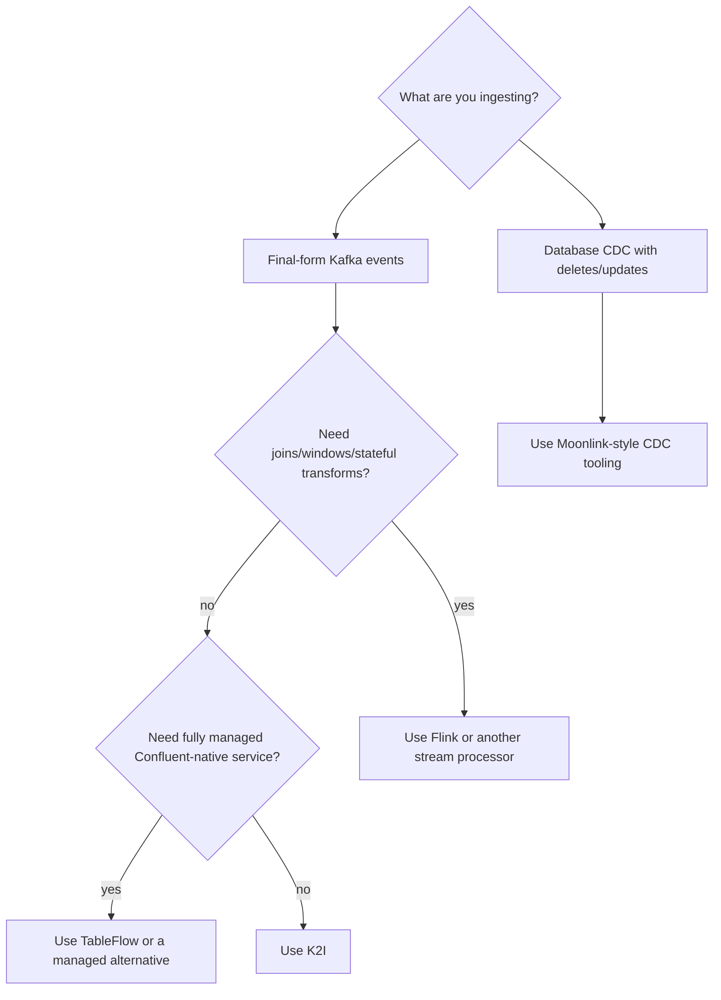

# K2I Compared With Kafka Connect, Flink, Spark, TableFlow, and Moonlink

K2I is not trying to replace every Kafka-to-Iceberg option. It is a narrow tool for final-form Kafka events that should become Apache Iceberg rows with less operational surface than a stream-processing cluster.

## Decision Summary

Use K2I when your Kafka topic already contains the rows you want to land in Iceberg and you want a standalone Rust service with local hot-read visibility and Docker-verifiable Iceberg output.

Choose another tool when you need joins, windows, cross-topic state, managed Confluent-native operations, or database CDC update/delete semantics.

## Comparison Table

| Dimension | K2I | Kafka Connect Iceberg Sink | Flink Iceberg Sink | Spark Micro-Batch | Confluent TableFlow | Moonlink |
|---|---|---|---|---|---|---|
| Primary fit | Final-form Kafka events to Iceberg | Connector-based ingestion | Stream processing and transforms | Batch/micro-batch ETL | Managed Confluent pipeline | Postgres CDC to Iceberg |
| Deployment | Single Rust binary/container | Kafka Connect cluster | Flink cluster | Spark runtime | Managed service | Service/extension stack |
| Transformations | Intentionally minimal | SMT/basic connector config | Strong | Strong | Limited/managed | CDC-focused |
| Hot reads | Local Arrow read-state RPC | No | No native local hot path | No | No local hot path | CDC-oriented |
| Schema path | Confluent Protobuf additive evolution | Connector/schema dependent | Engine dependent | Job dependent | Managed | CDC/schema dependent |
| Catalog path | REST validated locally; Glue/Hive/Nessie abstractions exist | Connector dependent | Engine dependent | Engine dependent | Managed | Catalog dependent |
| Best when | Events are already analytics-shaped | You already run Connect | You need joins/windows/state | Batch jobs are acceptable | You use Confluent Cloud | Source is Postgres |
| Avoid when | You need joins/windows/CDC deletes | You do not want Connect ops | You want simple ingestion only | You need low operational latency | You need OSS/self-hosted | Source is Kafka-only |

## K2I vs Kafka Connect Iceberg Sink

Kafka Connect is a good choice if you already operate Connect and want a connector-based deployment model. K2I is a separate service with its own Kafka consumer, transaction log, CLI, health server, metrics server, and read-state RPC.

Choose K2I when the appeal is a single binary/container and local E2E proof. Choose Kafka Connect when your platform standard is Connect workers and connector lifecycle management.

## K2I vs Flink Iceberg Sink

Flink is a stream processor. It is the better fit for joins, windows, stateful enrichment, routing, and complex event-time handling.

K2I intentionally avoids that surface. It is for Kafka events that are already in the shape you want to write to Iceberg.

## K2I vs Spark Micro-Batch

Spark is strong for batch transformations, backfills, and larger ETL workflows. It is heavier operationally for a simple continuously running topic-to-table path.

K2I keeps the ingestion loop always-on and single-process, with hot rows available locally before the cold Iceberg commit.

## K2I vs Confluent TableFlow

TableFlow is a managed Confluent-native path. It is useful when you want the ingestion lifecycle bundled into a managed platform.

K2I is open source and self-hosted. It is a better fit when you want to run the service yourself, control the writer path, and validate the result locally with Docker and DuckDB.

## K2I vs Moonlink

Moonlink is primarily CDC-oriented. K2I draws inspiration from the hot/cold architecture pattern, but it is Kafka-native and optimized for append-oriented final-form events rather than Postgres CDC update/delete semantics.

## Current Caveats

The comparison above describes product fit, not a claim that every K2I backend is equally hardened. Review [Production Readiness](./production-readiness.md) before broad rollout.
