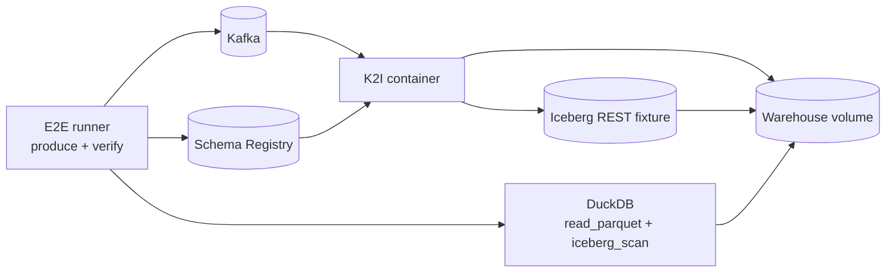

# DuckDB Iceberg Validation

K2I includes local Docker E2E flows that prove its output can be read as Parquet and as real Iceberg metadata. The Iceberg profiles use DuckDB direct Parquet reads and DuckDB `iceberg_scan`.

## Why DuckDB Validation Matters

Writing Parquet files is not the same as writing a valid Iceberg table. The Iceberg metadata tree also needs to reference those files through snapshots, manifests, schema, partition specs, and table metadata.

K2I validates both levels locally:

- direct Parquet reads prove data files contain the expected rows;
- DuckDB `iceberg_scan` proves the latest Iceberg metadata can be read by an external query engine.

## Docker E2E Topology



## Commands

Run the correctness profile:

```bash
scripts/e2e-docker-iceberg.sh
```

Expected success:

```text
ok: DuckDB iceberg_scan validated real Iceberg metadata
```

Run the load profile:

```bash
K2I_E2E_LOAD_MESSAGES=100000 scripts/e2e-docker-iceberg-load.sh
```

The load profile produces 100,000 Confluent-framed Protobuf rows by default and requires every row to flush cold before validation.

## What The Iceberg Flow Proves

- K2I starts against the Apache Iceberg REST fixture.
- K2I writes Parquet data files.
- K2I commits append metadata through the official Rust Iceberg implementation.
- The E2E runner validates committed file references through the read-state path.
- DuckDB reads the written Parquet files directly.
- DuckDB `iceberg_scan` reads the latest Iceberg metadata file.
- Metrics are checked so `k2i_errors_total` remains zero.

## Validation Scope

DuckDB validation is a strong local compatibility check, but it is not a replacement for validating the exact production catalog and object store you will run. Test your target REST, Glue, Hive, or Nessie setup with representative credentials, table size, partition layout, and failure modes.

See [Iceberg REST Catalog](./iceberg-rest-catalog.md) and [Production Readiness](./production-readiness.md).
