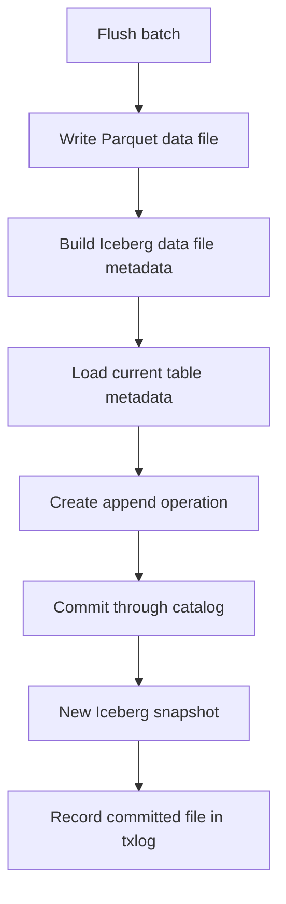

# Iceberg REST Catalog Support

K2I writes Parquet data files and commits Iceberg table metadata. The currently verified real-metadata path is the Apache Iceberg REST catalog flow, tested locally with the Apache Iceberg REST fixture and DuckDB `iceberg_scan`.

## What The Catalog Does

An Iceberg catalog tracks table metadata locations and coordinates table commits. Writing a valid Iceberg table requires more than writing Parquet files: each committed data file must become part of a snapshot in the table metadata.

## Commit Flow



## REST Configuration

```toml
[iceberg]
catalog_type = "rest"
warehouse_path = "s3://warehouse/events"
database_name = "analytics"
table_name = "events"
rest_uri = "http://localhost:8181"
```

Additional authentication, S3, and catalog-manager fields are documented in [Configuration](./configuration.md).

## Local REST Fixture

The Docker Iceberg E2E starts an Iceberg REST fixture and validates the output:

```bash
scripts/e2e-docker-iceberg.sh
```

The load profile verifies snapshot growth and row visibility under a larger workload:

```bash
K2I_E2E_LOAD_MESSAGES=100000 scripts/e2e-docker-iceberg-load.sh
```

## Catalog Backends

| Backend | Current status |
|---|---|
| REST | Real metadata commit path validated locally with Iceberg REST fixture and DuckDB `iceberg_scan` |
| AWS Glue | Catalog abstraction exists; validate against your AWS account before relying on it |
| Hive Metastore | Catalog abstraction exists; validate against your metastore version before relying on it |
| Nessie | Catalog abstraction exists; validate branch/ref behavior before relying on it |

## Storage Backends

The writer path is currently validated against local/Docker warehouse volumes and S3-compatible configuration used by the E2E environment. GCS and Azure configuration is declared, but writer creation for those backends is not complete.

## Production Notes

- Validate the exact catalog and object store you will operate.
- Test conflict behavior with representative concurrent writers if you plan to run any.
- Keep the transaction log on durable storage.
- Monitor Iceberg commit failures, flush duration, and error counters.

See [Production Readiness](./production-readiness.md).
