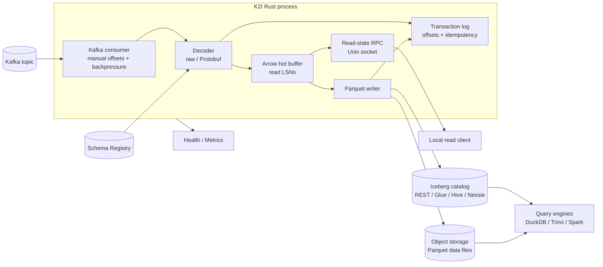
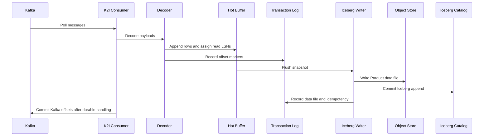
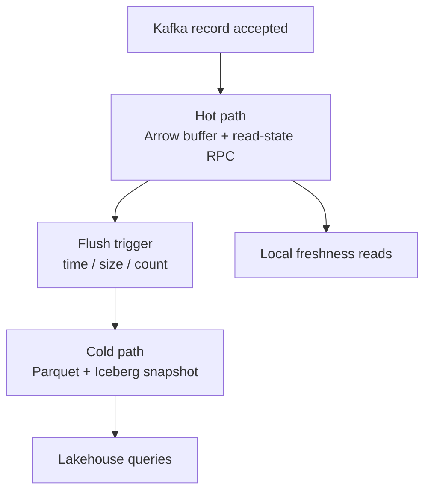

# Kafka to Iceberg with K2I

K2I is a standalone Kafka-to-Apache-Iceberg ingestion engine. It consumes one configured Kafka topic, decodes each message, keeps recent rows visible through an Arrow-backed local read path, and flushes Parquet data files into an Iceberg table.

Use this page when you want to understand the complete path from Kafka record to Iceberg snapshot.

## Why Kafka to Iceberg Is Hard

Kafka is optimized for low-latency streams of small messages. Apache Iceberg is optimized for analytics tables made from columnar data files and committed metadata snapshots. Bridging the two creates a few recurring problems:

- Small streaming batches can create too many small Parquet files.
- Kafka offsets, object-store files, and Iceberg commits need coordinated failure handling.
- Schema Registry changes need to become table-schema changes only when compatible.
- Query engines see data only after files are written and catalog metadata is committed.

K2I addresses this narrow ingestion problem without becoming a general stream processor.

## Where K2I Fits

K2I is a good fit when:

- Kafka messages are already shaped like analytics rows.
- The target is one Iceberg table per K2I process.
- You want a single Rust service/container instead of Flink, Spark, or Kafka Connect for this job.
- You need a local hot-read path before the next Iceberg commit.
- You want Docker E2E validation with real Iceberg REST metadata and DuckDB `iceberg_scan`.

K2I is not the right tool for joins, windows, multi-source ETL, or CDC update/delete semantics.

## End-to-End Flow



Main ordering:



## Hot and Cold Visibility

K2I exposes two visibility paths:



The hot path is local and optional. It is intended for co-located readers, sidecars, or adapters that can speak the read-state Unix socket protocol.

The cold path is the normal Iceberg analytics path. Query engines see new data after K2I writes Parquet and commits an Iceberg snapshot.

## Minimal Configuration

```toml
[kafka]
bootstrap_servers = ["localhost:9092"]
topic = "events"
consumer_group = "k2i-ingestion"

[kafka.format]
type = "protobuf"
schema_registry_url = "http://localhost:8081"
subject_strategy = "topic_name"
message_type = "example.events.v1.Event"

[schema_evolution]
mode = "auto-additive"
on_breaking_change = "pause"

[iceberg]
catalog_type = "rest"
warehouse_path = "s3://warehouse/events"
database_name = "analytics"
table_name = "events"
rest_uri = "http://localhost:8181"

[transaction_log]
log_dir = "./transaction_logs"

[rpc]
enabled = true
socket_path = "./run/k2i.sock"
```

See [Configuration](./configuration.md) for all options.

## Local Proof

Run the correctness profile:

```bash
scripts/e2e-docker-iceberg.sh
```

Run the 100,000-row Iceberg load profile:

```bash
K2I_E2E_LOAD_MESSAGES=100000 scripts/e2e-docker-iceberg-load.sh
```

The Iceberg flow validates that K2I commits real Iceberg REST metadata and that DuckDB can read it through `iceberg_scan`.

## Limitations

- One configured Kafka topic and one configured table per process today.
- Multi-partition flush and offset commit behavior needs continued hardening.
- Startup recovery state is computed, but Kafka seeking/deduplication and startup orphan cleanup need further wiring.
- JSON is currently a raw-compatible path, not a fully typed JSON-to-Iceberg projection.
- GCS and Azure object-store configuration is declared, but writer creation is not complete for those backends.
- Maintenance commands exist, but scheduler wiring should be reviewed for each deployment.

See [Production Readiness](./production-readiness.md) for the complete current status.
