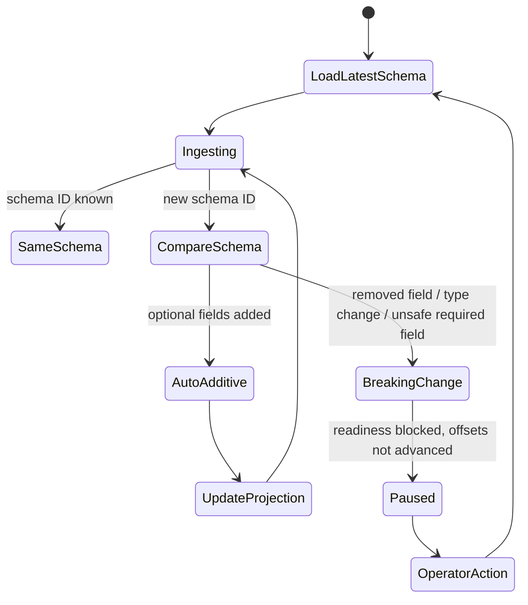

# Schema Registry Protobuf Ingest

K2I can decode Confluent-framed Protobuf messages from Kafka using Confluent Schema Registry. This is the typed ingest path with schema evolution support.

## Message Format

The Protobuf decoder expects Confluent wire-format values:

1. Magic byte.
2. Schema ID.
3. Message indexes for nested Protobuf message selection.
4. Protobuf payload bytes.

K2I resolves the schema ID through Schema Registry, builds a descriptor, selects the configured message type, and projects fields into Arrow-compatible rows and Iceberg-compatible schema updates.

## Configuration

```toml
[kafka.format]
type = "protobuf"
schema_registry_url = "http://schema-registry:8081"
subject_strategy = "topic_name"
message_type = "example.events.v1.Event"
cache_ttl_seconds = 300
latest_on_startup = true

[schema_evolution]
mode = "auto-additive"
on_breaking_change = "pause"
schema_update_min_interval_seconds = 60
```

Subject strategies:

| Strategy | Behavior |
|---|---|
| `topic_name` | Uses the Kafka topic as the subject basis |
| `record_name` | Uses the Protobuf record name; `message_type` is required |
| `topic_record_name` | Uses topic plus record name; `message_type` is required |

`message_type` is also required when a schema contains multiple non-map-entry message types.

## Schema Cache

K2I keeps Schema Registry responses in memory and writes a stale disk cache under:

```text
<transaction_log.log_dir>/schema-cache
```

The disk cache is a resilience aid for short registry outages. It is not a replacement for operating Schema Registry.

## Schema Evolution State Machine



## Compatible Changes

In `auto-additive` mode, K2I can add compatible nullable fields. Additive changes are recorded in the transaction log and reflected in the schema projection used by the writer and read-state path.

## Breaking Changes

Breaking changes include removed fields, incompatible type changes, unsafe required-field additions, and other changes that cannot be safely projected into the existing table.

With `on_breaking_change = "pause"`, K2I keeps the process alive, degrades schema health, blocks `/readyz`, and avoids advancing offsets past incompatible data.

`skip-message` currently pauses instead of skipping. This avoids losing incompatible data without a durable dead-letter workflow.

## E2E Coverage

The Docker correctness flow validates:

- Protobuf v1 ingestion.
- v2 nullable field addition.
- hot Arrow IPC visibility for the evolved schema.
- Parquet reads across v1/v2 files with DuckDB `union_by_name`.
- breaking v3 type-change rejection.
- readiness blocking after the breaking change.

Run:

```bash
scripts/e2e-docker.sh
```
