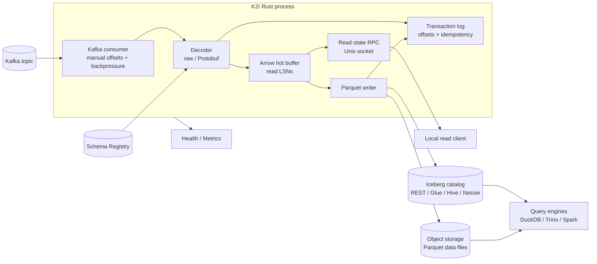
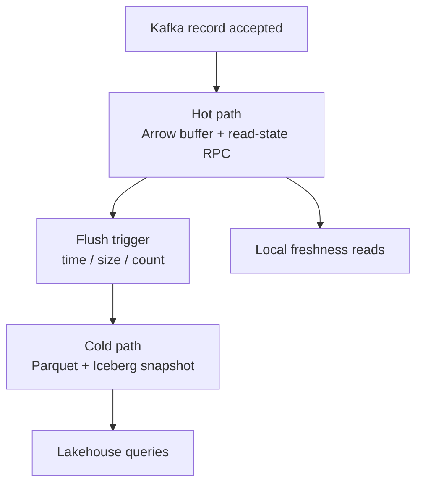
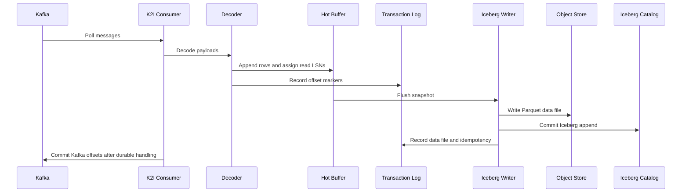
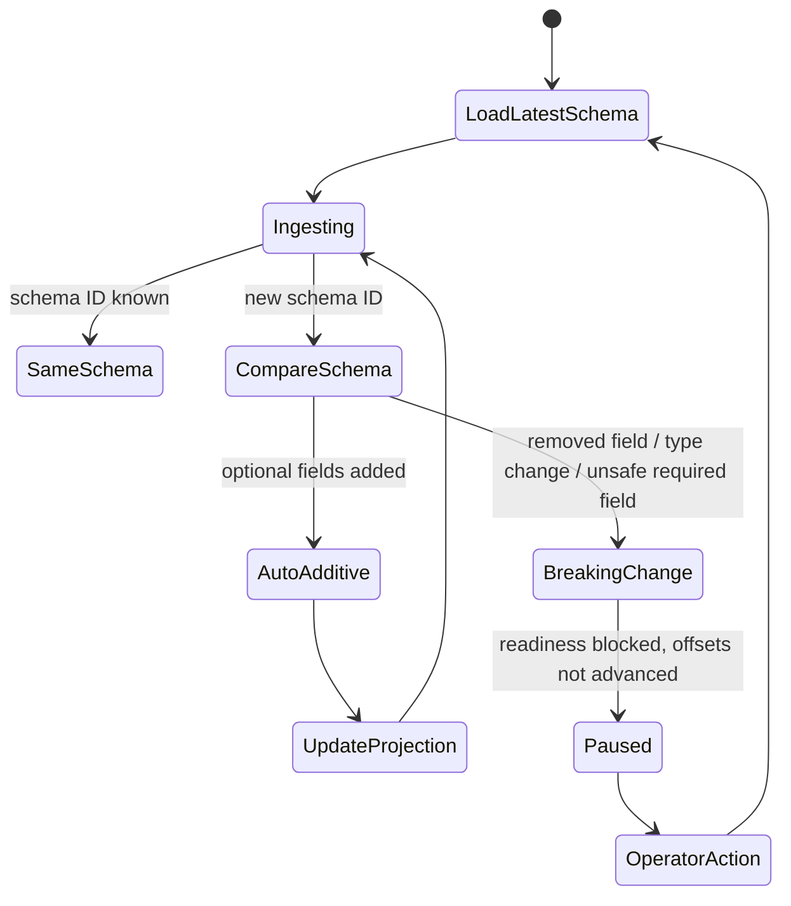
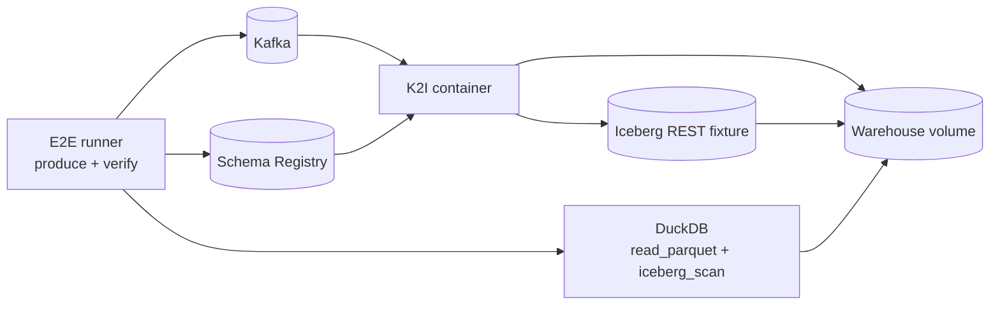
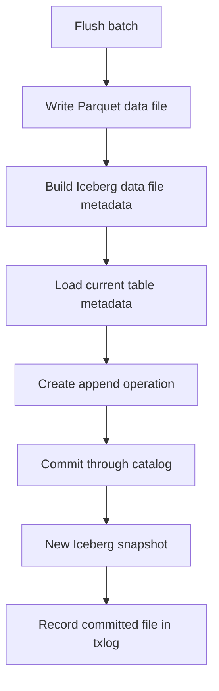
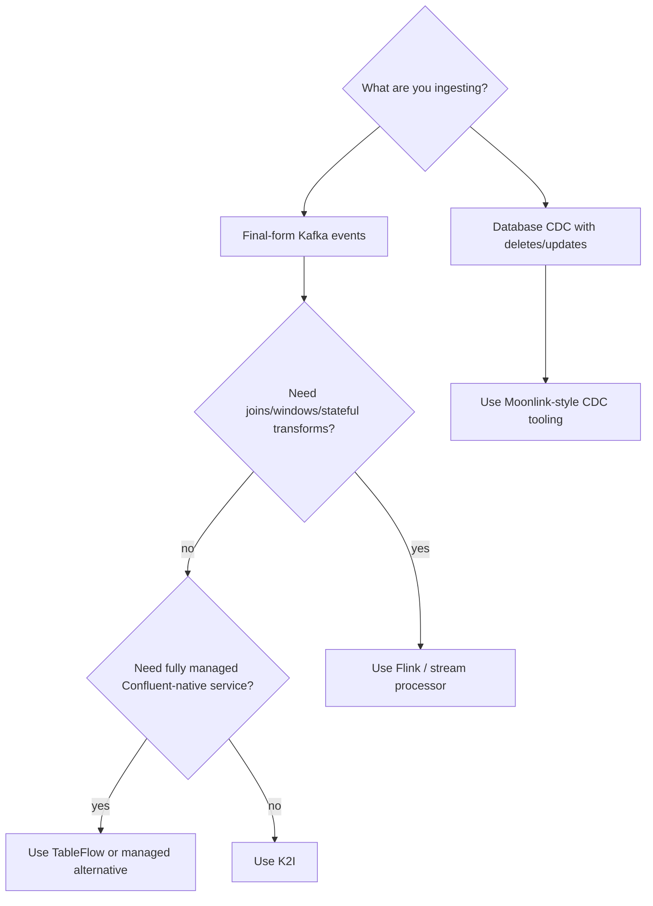

# K2I Content Implementation Plan

Date: 2026-05-05

This is the execution plan for updating the public README, documentation, and diagrams so the repo clearly explains what K2I now does and is positioned around the researched search intent.

Primary positioning:

> K2I: Kafka to Apache Iceberg in one Rust binary.

Secondary proof points:

- Standalone Kafka consumer/service, not a Kafka Connect plugin.
- Confluent Schema Registry Protobuf decoding with additive schema evolution.
- Arrow-backed hot read path through local read-state RPC.
- Parquet data files committed to Iceberg metadata through the REST catalog path.
- WAL/idempotency/recovery design for exactly-once-style durability.
- Docker E2E validation with Kafka, Schema Registry, Iceberg REST, DuckDB direct Parquet reads, and DuckDB `iceberg_scan`.

## Content Principles

1. **Lead with exact intent.** Use `Kafka to Iceberg` in the README H1, opening paragraph, docs index, and first SEO landing doc.
2. **Be precise about guarantees.** Prefer `designed for exactly-once-style durability` over unqualified `exactly-once`.
3. **Separate hot and cold freshness.** Hot rows are visible through local read-state RPC; Iceberg table visibility depends on flush and catalog commit timing.
4. **Make validation visible.** Docker E2E and DuckDB `iceberg_scan` should appear above the fold and in a dedicated doc.
5. **Do not pretend K2I is general stream processing.** It is for final-form Kafka event streams, not joins/windows/CDC delete semantics.
6. **Use diagrams as product explanation, not decoration.** Each diagram must answer a user question.

## README Rewrite Plan

### Target Audience

Data/platform engineers who already run Kafka and want Iceberg/Parquet lakehouse tables without operating Flink, Spark micro-batches, or a Kafka Connect cluster for simple final-form event ingestion.

### Target Keywords

- Primary: `kafka to iceberg`
- Secondary: `kafka iceberg sink`, `iceberg streaming ingestion`, `iceberg rest catalog`, `duckdb iceberg`, `kafka schema registry`, `confluent schema registry`

### New README Outline

1. **Hero**
   - H1: `K2I: Kafka to Apache Iceberg in One Rust Binary`
   - Tagline: `Stream final-form Kafka events into Iceberg tables with Protobuf Schema Registry decoding, Arrow hot reads, Parquet writes, and Docker-verified DuckDB/Iceberg validation.`
   - One paragraph explaining standalone service, single topic/table per process today, hot/cold architecture.

2. **Use K2I When**
   - You have final-form Kafka events that should become analytics rows.
   - You want Iceberg/Parquet output without Flink/Spark/Kafka Connect infrastructure for this job.
   - You need local fresh read visibility before the next Iceberg commit.
   - You want a local Docker E2E harness that proves the table is readable by DuckDB.

3. **Quick Local Proof**
   - `scripts/e2e-docker-iceberg.sh`
   - `K2I_E2E_LOAD_MESSAGES=100000 scripts/e2e-docker-iceberg-load.sh`
   - Expected success line: `ok: DuckDB iceberg_scan validated real Iceberg metadata`

4. **What K2I Does**
   - Kafka consumer with backpressure.
   - Raw/JSON-compatible raw payloads and Protobuf decoder.
   - Schema Registry cache and additive evolution.
   - Arrow hot buffer and read-state RPC.
   - Parquet writer and Iceberg catalog commit.
   - WAL, idempotency, recovery records.
   - Health, metrics, CLI, man pages.

5. **Architecture Diagram**
   - Use the high-level Mermaid diagram specified below.

6. **K2I vs Alternatives**
   - Table comparing K2I, Kafka Connect Iceberg sink, Flink Iceberg sink, Spark micro-batch, Confluent TableFlow, Moonlink.
   - Keep it factual, scoped, and non-hostile.

7. **Quick Start**
   - Keep config example short.
   - Link deeper configuration docs instead of putting full config in README.

8. **What Is Validated**
   - Cargo check/test/clippy/fmt.
   - Man page generation test.
   - Docker correctness E2E.
   - Docker load E2E.
   - Docker Iceberg REST + DuckDB `iceberg_scan`.
   - 100k-row Iceberg load run.

9. **Current Release Caveats**
   - Multi-partition flush/commit hardening.
   - Startup recovery state application.
   - Async Kafka commit acknowledgement.
   - Per-entry fsync behavior.
   - GCS/Azure writer wiring.
   - Maintenance scheduler wiring.
   - Link to `docs/production-readiness.md`.

10. **Docs Index**
   - Link SEO landing docs and existing technical docs.

11. **FAQ**
   - 6-8 short answers directly in README.
   - Link to full `docs/faq.md`.

## New Docs To Create

### `docs/kafka-to-iceberg.md`

Primary target: `kafka to iceberg`

Purpose: the main explanatory page for how K2I turns Kafka messages into Iceberg table data.

Outline:

- What Kafka-to-Iceberg ingestion means.
- Why streaming writes create small files and catalog/commit complexity.
- Where K2I fits.
- End-to-end flow from Kafka record to Iceberg snapshot.
- Hot read-state vs cold Iceberg visibility.
- Minimal config.
- Local Docker E2E proof.
- Limitations and when to choose Flink/Kafka Connect/TableFlow instead.

Required diagrams:

- High-level architecture.
- Write path sequence.
- Hot/cold freshness.

### `docs/comparisons.md`

Primary targets: `kafka connect iceberg sink`, `flink iceberg sink`, `confluent tableflow`

Purpose: help users decide if K2I is the right tool.

Outline:

- Decision summary.
- Comparison table.
- K2I vs Kafka Connect Iceberg sink.
- K2I vs Flink Iceberg sink.
- K2I vs Spark micro-batch.
- K2I vs Confluent TableFlow.
- K2I vs Moonlink.
- Which tool should I choose?

Required diagrams:

- Decision tree.

### `docs/duckdb-iceberg-validation.md`

Primary targets: `duckdb iceberg`, `duckdb iceberg rest catalog`

Purpose: explain the local verification story and make the DuckDB proof point discoverable.

Outline:

- Why DuckDB validation matters.
- What `scripts/e2e-docker-iceberg.sh` starts.
- How K2I commits real Iceberg REST metadata.
- What DuckDB `iceberg_scan` validates.
- What the 100k-row load profile validates.
- Known DuckDB/Iceberg validation scope.

Required diagrams:

- Docker E2E topology.

### `docs/schema-registry-protobuf.md`

Primary targets: `kafka schema registry`, `confluent schema registry`, `protobuf schema registry`

Purpose: explain the Protobuf path and schema evolution behavior.

Outline:

- Confluent wire format and schema IDs.
- Subject strategies.
- Descriptor resolution.
- Arrow/Iceberg projection.
- Additive schema changes.
- Breaking schema changes and readiness pause.
- Stale schema cache behavior.
- E2E coverage.

Required diagrams:

- Schema evolution state machine.

### `docs/iceberg-rest-catalog.md`

Primary targets: `iceberg rest catalog`, `iceberg rest api`

Purpose: explain the REST catalog path and current catalog support.

Outline:

- What an Iceberg catalog does.
- REST catalog commit flow.
- How K2I writes Parquet and commits metadata.
- Current REST path validation.
- Glue/Hive/Nessie abstractions.
- Current caveats by backend.
- Local `apache/iceberg-rest-fixture` setup.

Required diagrams:

- Catalog commit flow.

### `docs/faq.md`

Primary target: LLM extraction and question search.

Questions:

- What is K2I?
- Is K2I a Kafka Connect plugin?
- How is K2I different from a Kafka Connect Iceberg sink?
- How is K2I different from Flink's Iceberg sink?
- How is K2I different from Confluent TableFlow?
- Is K2I a CDC tool like Moonlink?
- Does K2I provide exactly-once delivery?
- How fresh is data in K2I?
- Can DuckDB read the Iceberg tables written by K2I?
- Which Iceberg catalogs does K2I support?
- How does K2I handle Protobuf schema evolution?
- What happens on a breaking schema change?
- What local E2E tests should I run before a release?
- What remains to harden before broad production rollout?

## Existing Docs To Update

| File | Required Changes |
|---|---|
| `README.md` | Full hero/structure rewrite, new comparison and validation sections, safer claim wording |
| `docs/README.md` | Reframe as `Kafka to Iceberg` documentation hub; link new docs prominently |
| `docs/quickstart.md` | Start with local Docker E2E proof, then manual config flow |
| `docs/architecture.md` | Add hot/cold freshness diagram, write path sequence, and caveat wording |
| `docs/configuration.md` | Add sections/anchors for Schema Registry, Iceberg REST catalog, local filesystem/S3 |
| `docs/commands.md` | Ensure man-page generation and Docker E2E commands are in release workflow |
| `docs/deployment.md` | Separate first-release recommended deployment from future production-hardening notes |
| `docs/troubleshooting.md` | Add links from schema pause, DuckDB validation, catalog commit, and recovery sections |
| `docs/production-readiness.md` | Keep as claims backstop; update verification and release caveat summary |
| `AGENTS.md` | Add docs positioning rules so future agents do not reintroduce overclaims |

## Diagram Plan

Use Mermaid diagrams in Markdown for maintainability and GitHub rendering. Do not create standalone image assets unless a website/landing page later needs custom visuals.

### 1. README High-Level Architecture

Question answered: “What does K2I do?”

Placement:

- README `Architecture`
- `docs/kafka-to-iceberg.md`
- `docs/architecture.md`



### 2. Hot/Cold Freshness Diagram

Question answered: “What is sub-second hot visibility vs Iceberg visibility?”

Placement:

- README short version
- `docs/kafka-to-iceberg.md`
- `docs/architecture.md`



### 3. Write Path Sequence

Question answered: “Where are offsets, WAL records, files, and catalog commits ordered?”

Placement:

- `docs/kafka-to-iceberg.md`
- `docs/architecture.md`
- `docs/production-readiness.md`



### 4. Protobuf Schema Evolution State Machine

Question answered: “What happens when a schema changes?”

Placement:

- `docs/schema-registry-protobuf.md`
- `docs/architecture.md`



### 5. Docker E2E Topology

Question answered: “What does local end-to-end validation actually prove?”

Placement:

- `docs/duckdb-iceberg-validation.md`
- README validation section



### 6. Catalog Commit Flow

Question answered: “How do Parquet files become an Iceberg table snapshot?”

Placement:

- `docs/iceberg-rest-catalog.md`
- `docs/architecture.md`



### 7. Tool Choice Decision Tree

Question answered: “Should I use K2I or something else?”

Placement:

- README comparison section
- `docs/comparisons.md`



## Internal Link Map

README links should drive users to:

- `docs/kafka-to-iceberg.md` from the hero/opening.
- `docs/quickstart.md` from quick proof.
- `docs/duckdb-iceberg-validation.md` from validation.
- `docs/schema-registry-protobuf.md` from feature list.
- `docs/iceberg-rest-catalog.md` from catalog/REST claims.
- `docs/comparisons.md` from “K2I vs alternatives.”
- `docs/production-readiness.md` from release caveats.
- `docs/faq.md` from README FAQ.

Each new doc should link back to:

- README.
- `docs/architecture.md`.
- `docs/configuration.md`.
- `docs/production-readiness.md` when discussing caveats.

## Implementation Phases

### Phase 1: README First

Goal: make the repo understandable in the first screen.

Tasks:

- Rewrite hero and opening copy.
- Replace generic feature list with current capability list.
- Add “Use K2I when / Do not use K2I when”.
- Add high-level Mermaid architecture diagram.
- Add “What is validated locally” section.
- Add release caveats and docs index.

Acceptance criteria:

- The first 300 words answer what K2I is, who it is for, what it writes, and what has been tested.
- The README no longer contains unqualified `production-grade`, `exactly-once`, or `sub-second query freshness` claims.

### Phase 2: Landing And Comparison Docs

Goal: capture search intent and reduce README length.

Tasks:

- Add `docs/kafka-to-iceberg.md`.
- Add `docs/comparisons.md`.
- Add `docs/faq.md`.
- Link from README and `docs/README.md`.

Acceptance criteria:

- The `Kafka to Iceberg` landing page can stand alone as an explanation for someone arriving from search.
- Comparison content is factual and does not present K2I as a universal replacement.

### Phase 3: Proof And Integration Docs

Goal: make the technical proof points obvious.

Tasks:

- Add `docs/duckdb-iceberg-validation.md`.
- Add `docs/schema-registry-protobuf.md`.
- Add `docs/iceberg-rest-catalog.md`.
- Add Docker E2E expected outputs.

Acceptance criteria:

- A user can tell exactly which command validates DuckDB `iceberg_scan`.
- Schema Registry behavior and breaking-change pause semantics are documented.
- REST catalog support is described with current backend caveats.

### Phase 4: Existing Doc Cleanup

Goal: align older docs with current implementation.

Tasks:

- Update `docs/README.md`.
- Update `docs/quickstart.md`.
- Update `docs/architecture.md`.
- Update `docs/configuration.md`.
- Update `docs/deployment.md`.
- Update `docs/troubleshooting.md`.
- Update `AGENTS.md` docs guidance.

Acceptance criteria:

- Docs do not conflict on config keys, catalog support, JSON behavior, maintenance wiring, or release caveats.
- Older PRD/analysis docs are clearly historical or moved below current user-facing docs in the index.

### Phase 5: Verification

Docs-only verification:

```bash
rg -n "production-grade|exactly-once semantics|sub-second query freshness|GCS|Azure|automated maintenance" README.md docs AGENTS.md
git diff --check
cargo run -p k2i-cli -- completions man --output-dir docs/man/man1
cargo test -p k2i-cli --test man_pages --no-fail-fast
```

Full pre-release verification after content changes:

```bash
cargo fmt --all --check
cargo check --workspace --all-targets
cargo test --workspace --no-fail-fast
cargo clippy --workspace --all-targets -- -D warnings
scripts/e2e-docker-iceberg.sh
K2I_E2E_LOAD_MESSAGES=100000 scripts/e2e-docker-iceberg-load.sh
```

## Open Decisions

1. **Where should historical PRD docs live?** Current `docs/` has PRDs and competitive analysis mixed with user-facing docs. For release, consider moving historical planning docs under `docs/archive/` or clearly labeling them.
2. **Should diagrams be Mermaid only?** Recommendation: yes for README/docs. Generate image assets only for the website/landing page later.
3. **Should release docs call K2I “production ready”?** Recommendation: no. Use `production-oriented first public release` and list hardening caveats.
4. **Should the README include the full config example?** Recommendation: no. Keep a short config snippet and link `docs/configuration.md` plus `config/example.toml`.
5. **Should comparison docs include competitor logos/screenshots?** Recommendation: no for now. Use text tables to avoid maintenance and trademark noise.
